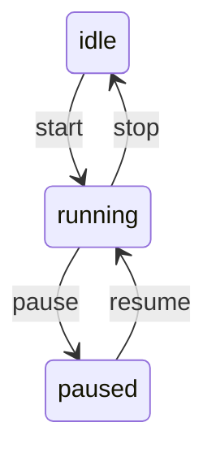
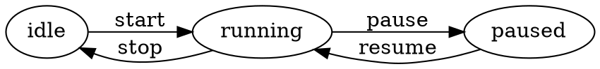

# State Machine Utils - 有限状态机工具

提供完整的有限状态机 (FSM) 实现功能。零外部依赖，仅使用 Python 标准库。

## 核心功能

- **状态定义与转换** - 支持基本状态、复合状态、历史状态
- **条件触发转换** - 通过守卫函数控制转换条件
- **进入/退出状态回调** - 支持状态进入和退出时的自定义动作
- **历史状态支持** - 保存和恢复状态历史
- **并行状态支持** - 多个状态机并行运行
- **状态持久化与恢复** - JSON序列化状态机状态
- **事件队列处理** - 异步事件队列支持
- **状态机可视化** - 支持文本、Mermaid、DOT格式导出

## 安装

```python
from state_machine_utils import StateMachine, State, create_simple_fsm
```

## 快速开始

### 方式一：使用快速创建函数

```python
from state_machine_utils import create_simple_fsm, simulate_fsm

# 快速创建状态机
sm = create_simple_fsm(
    states=["idle", "running", "paused", "stopped"],
    transitions=[
        ("idle", "running", "start"),
        ("running", "paused", "pause"),
        ("paused", "running", "resume"),
        ("running", "stopped", "stop"),
        ("paused", "stopped", "stop"),
        ("stopped", "idle", "reset")
    ],
    initial="idle"
)

# 启动状态机
sm.start()

# 发送事件
sm.send("start")  # idle -> running
sm.send("pause")  # running -> paused

# 模拟事件序列
history = simulate_fsm(sm, ["start", "pause", "resume", "stop"])
```

### 方式二：使用流式API

```python
from state_machine_utils import StateMachineBuilder

sm = (StateMachineBuilder("TrafficLight")
    .state("red")
    .state("green")
    .state("yellow")
    .initial("red")
    .transition("red", "green", "timer")
    .transition("green", "yellow", "timer")
    .transition("yellow", "red", "timer")
    .build())

sm.start()
```

### 方式三：完整定义

```python
from state_machine_utils import State, StateMachine

# 定义状态（带回调）
def on_enter_running():
    print("进入运行状态")

def on_exit_running():
    print("退出运行状态")

idle = State("idle")
running = State("running", on_enter=on_enter_running, on_exit=on_exit_running)
paused = State("paused")

# 创建状态机
sm = StateMachine(initial_state=idle)
sm.add_state(running)
sm.add_state(paused)

# 添加转换（带守卫条件和动作）
def can_start():
    return True

def on_start():
    print("启动!")

sm.add_transition(idle, running, "start", guard=can_start, action=on_start)
sm.add_transition(running, paused, "pause")
sm.add_transition(paused, running, "resume")
sm.add_transition(running, idle, "stop")

# 启动并运行
sm.start()
sm.send("start")  # 输出: 进入运行状态, 启动!
```

## API 文档

### State 类

```python
State(
    name: str,
    state_type: StateType = StateType.BASIC,
    on_enter: Optional[Callable] = None,
    on_exit: Optional[Callable] = None
)
```

**状态类型：**
- `StateType.BASIC` - 基本状态
- `StateType.COMPOSITE` - 复合状态（包含子状态）
- `StateType.FINAL` - 终止状态
- `StateType.INITIAL` - 初始状态
- `StateType.HISTORY` - 历史状态
- `StateType.PARALLEL` - 并行状态

### StateMachine 类

```python
StateMachine(initial_state: State, name: str = "StateMachine")
```

**主要方法：**

| 方法 | 描述 |
|------|------|
| `add_state(state)` | 添加状态 |
| `add_transition(from, to, event, guard?, action?)` | 添加转换 |
| `on_event(name, handler)` | 注册事件处理器 |
| `start()` | 启动状态机 |
| `send(event, data?)` | 发送事件 |
| `send_async(event, data?)` | 异步发送事件 |
| `process_queue()` | 处理事件队列 |
| `is_in_state(state)` | 检查当前状态 |
| `can_transition(event)` | 检查是否可转换 |
| `get_available_events()` | 获取可用事件 |
| `save_state()` | 保存状态为JSON |
| `load_state(json)` | 从JSON恢复状态 |
| `reset()` | 重置状态机 |
| `visualize(format)` | 可视化（text/mermaid/dot） |

### 工具函数

```python
# 快速创建
create_simple_fsm(states, transitions, initial) -> StateMachine

# 验证
validate_state_machine(sm) -> List[str]  # 返回错误列表

# 序列化
fsm_to_json(sm) -> str
json_to_fsm(json) -> StateMachine

# 模拟
simulate_fsm(sm, events) -> List[str]

# 可视化
get_state_diagram(sm) -> str  # Mermaid格式
```

### 预定义模板

```python
from state_machine_utils import (
    create_turnstile_fsm,   # 旋转门状态机
    create_traffic_light_fsm, # 交通灯状态机
    create_order_fsm,        # 订单状态机
    create_tcp_fsm            # TCP连接状态机（简化版）
)

# 旋转门
sm = create_turnstile_fsm()
sm.start()
sm.send("coin")   # locked -> unlocked
sm.send("push")   # unlocked -> locked

# 交通灯
sm = create_traffic_light_fsm()
sm.start()
sm.send("timer")  # red -> green
sm.send("timer")  # green -> yellow
sm.send("timer")  # yellow -> red

# 订单
sm = create_order_fsm()
sm.start()
sm.send("pay")     # created -> paid
sm.send("ship")    # paid -> shipped
sm.send("deliver") # shipped -> delivered

# TCP连接
sm = create_tcp_fsm()
sm.start()
sm.send("open")            # CLOSED -> LISTEN
sm.send("send_syn")        # LISTEN -> SYN_SENT
sm.send("receive_syn_ack") # SYN_SENT -> ESTABLISHED
```

## 并行状态机

```python
from state_machine_utils import ParallelStateMachine, create_simple_fsm

# 创建多个状态机
switch1 = create_simple_fsm(["off", "on"], [("off", "on", "toggle"), ("on", "off", "toggle")], "off")
switch1.name = "switch1"

switch2 = create_simple_fsm(["off", "on"], [("off", "on", "toggle"), ("on", "off", "toggle")], "off")
switch2.name = "switch2"

# 创建并行状态机
parallel = ParallelStateMachine()
parallel.add_region(switch1)
parallel.add_region(switch2)
parallel.start()

# 同时控制所有区域
parallel.send("toggle")  # 两个开关同时切换

# 获取所有区域状态
states = parallel.get_states()
# {"switch1": State(on), "switch2": State(on)}
```

## 可视化输出

### 文本格式

```python
print(sm.visualize("text"))
```

```
State Machine: StateMachine
========================================

States: ['idle', 'running', 'paused']

Current State: idle

Transitions:
  idle --[start]--> running
  running --[pause]--> paused
  paused --[resume]--> running
  running --[stop]--> idle

Statistics:
  Transitions: 0
  Events: 0
```

### Mermaid 格式

```python
print(sm.visualize("mermaid"))
```



### DOT 格式

```python
print(sm.visualize("dot"))
```



## 复合状态

```python
from state_machine_utils import State, StateMachine, StateType

# 定义复合状态
active = State("active", state_type=StateType.COMPOSITE)
running = State("running")
paused = State("paused")

# 添加子状态
active.add_child(running, is_initial=True)
active.add_child(paused)

# 创建状态机
idle = State("idle")
sm = StateMachine(initial_state=idle)
sm.add_state(active)  # 自动添加子状态

sm.add_transition(idle, running, "start")
sm.add_transition(running, paused, "pause")
```

## 状态持久化

```python
# 保存状态
saved_state = sm.save_state()
# {"current_state": "running", "context": {...}, ...}

# ... 稍后恢复 ...

# 加载状态
sm.load_state(saved_state)
```

## 完整示例

```python
from state_machine_utils import StateMachine, State

# 订单状态机示例
def on_payment_received():
    print("✅ 支付已确认，准备发货")

def on_shipped():
    print("📦 订单已发货")

def on_delivered():
    print("🎉 订单已送达")

# 定义状态
created = State("created")
paid = State("paid", on_enter=on_payment_received)
shipped = State("shipped", on_enter=on_shipped)
delivered = State("delivered", on_enter=on_delivered)
cancelled = State("cancelled")

# 创建状态机
order_fsm = StateMachine(initial_state=created, name="OrderFSM")
order_fsm.add_state(paid)
order_fsm.add_state(shipped)
order_fsm.add_state(delivered)
order_fsm.add_state(cancelled)

# 定义转换
order_fsm.add_transition(created, paid, "pay")
order_fsm.add_transition(created, cancelled, "cancel")
order_fsm.add_transition(paid, shipped, "ship")
order_fsm.add_transition(paid, cancelled, "refund")
order_fsm.add_transition(shipped, delivered, "deliver")
order_fsm.add_transition(shipped, cancelled, "return")

# 运行
order_fsm.start()
order_fsm.send("pay")      # 输出: ✅ 支付已确认，准备发货
order_fsm.send("ship")     # 输出: 📦 订单已发货
order_fsm.send("deliver")  # 输出: 🎉 订单已送达

# 查看历史
print(order_fsm.get_history())
# [('pay', 'created', 'paid'), ('ship', 'paid', 'shipped'), ('deliver', 'shipped', 'delivered')]

# 导出可视化
print(order_fsm.visualize("mermaid"))
```

## 测试

```bash
python -m pytest state_machine_utils_test.py -v
```

## 许可证

MIT License